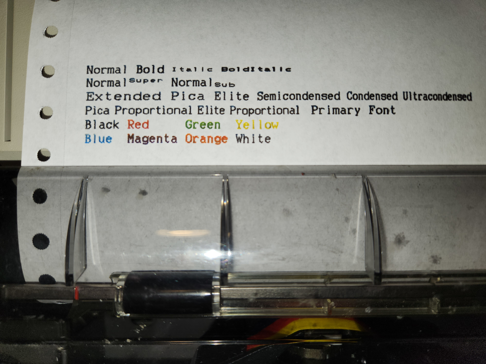

ansi2iwii
=========

Tool to convert ANSI escape sequences to those compatible with the Apple
ImageWriter II.

Example
-------

Example of a printout generated using `test.sh` and a color ribbon:


Supported ANSI Escape Codes
---------------------------

Currently only a subset of SGR (Screen Graphic Rendition) ANSI escape sequences
(following the form of `ESC[<num>[...]m`) are supported:

| SGR   | Description               | IWII        | Notes                                                 |
|-------|---------------------------|-------------|-------------------------------------------------------|
| 0     | Reset                     | (multiple)  |                                                       |
| 1     | Bold                      | `ESC !`     |                                                       |
| 3     | Italic                    | `ESC w`     | Approximating using half height text on the IWII side |
| 4     | Underline                 | `ESC X`     |                                                       |
| 8     | Conceal                   | N/A         | Prints spaces while enabled                           |
| 9     | Strikethrough             | `\b-`       | Prints - over each character (slow)                   |
| 10    | Primary Font              | (multiple)  | Set via `--font`, defaults to Elite                   |
| 11-19 | Set Font                  | (multiple)  | See `--help` for details                              |
| 22    | Normal Intensity/Bold Off | `ESC "`     |                                                       |
| 23    | Italic Off                | `ESC W`     | See note on 3                                         |
| 24    | Underline Off             | `ESC Y`     |                                                       |
| 26    | Proportional Spacing      | (multiple)  | Sets font to pica/elite proportional                  |
| 28    | Conceal Off               | N/A         |                                                       |
| 29    | Strikethrough Off         | N/A         |                                                       |
| 30-37 | Set Foreground Color      | (multiple)  | Cyan (6) represented by orange                        |
| 50    | Proportional Spacing Off  | (multiple)  |                                                       |
| 73    | Superscript               | `ESC x`     |                                                       |
| 74    | Subscript                 | `ESC y`     |                                                       |
| 75    | Superscript/Subscript Off | `ESC z`     |                                                       |

Additional ImageWriter II escape codes are supported through command-line options.

Usage
-----

The main intended use of `ansi2iwii` is to be used as an intermediate program
between a program generating text, and the printer's serial port. e.g.:

```
... | ansi2iwii -o /dev/ttyUSB0
```

```
$ ./ansi2iwii --help
ansi2iwii: Convert ANSI escape codes to Apple ImageWriter II escape codes

Options:
  -h, --help             Display this help message
  -v, --verbose[=LEVEL]  Increase verbosity, can be supplied multiple times, or desired
                         verbosity can be directly supplied
  -i, --input=FILE       Read input from FILE, use `-` for stdin (default)
  -o, --output=FILE      Write output to FILE, use `-` for stdout (default)
  -b, --baud=RATE        Set baud rate to use when output is set to the printer's serial
                         port. Values 300, 1200, 2400, and 9600 (default) are accepted
  -F, --flow=MODE        Set flow control mode when using serial as output
                           0: None
                           1: XON/XOFF (default)
                           2: RTS/CTS
  -N, --no-setup         Do not configure printer via escape codes on startup
  -c, --color[=COLOR]    Enable support for color, set default color if supplied.
                           0: Black (default)
                           1: Red
                           2: Green
                           3: Yellow
                           4: Blue
                           5: Purple
                           6: Orange
  -f, --font=FONT        Set default font to use:
                           0: Extended
                           1: Pica
                           2: Elite (default)
                           3: Semicondensed
                           4: Condensed
                           5: Ultracondensed
                           6: Pica proportional
                           7: Elite proportional
  -q, --quality=QUAL     Set print quality to use:
                           0: Draft (default)
                           1: Standard
                           2: Near Letter Quality
  -l, --lpi=LPI          Set number of lines per inch, 6 or 8 (default)
```

